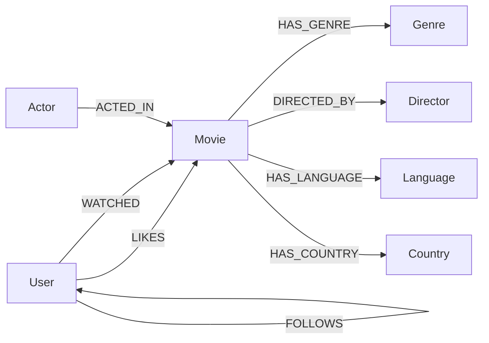

# CineGraph API

Express + Neo4j (CognoDB Cloud) backend for **CineGraph** — a graph-powered movie discovery
engine built for the WEXA AI CognoDB assignment.

CineGraph demonstrates what a graph database does better than a relational one: multi-hop
traversal, relationship-driven recommendations, and explainable “why was this suggested”
answers — all as first-class Cypher queries. This package owns the REST API, Cypher modules,
recommendation scoring, and the idempotent seed script.

Pair it with the [frontend](https://github.com/NSINGHRAJPUT/movie-suggestions-frontend/blob/main/README.md) (Next.js UI + React Flow graph explorer).

---

## Why a graph database?

Every core feature is a multi-hop relationship query. In SQL each would need several JOINs,
subqueries, or recursive CTEs; in CognoDB they’re a single readable `MATCH` pattern.

- **Recommendation traversal.** “Movies liked by people I follow” is
  `MATCH (u)-[:FOLLOWS]->(f)-[:LIKES]->(m)` — a 2-hop join that would be
  `users ⋈ follows ⋈ likes ⋈ movies` plus a `NOT EXISTS` anti-join in SQL.
- **Many-to-many everywhere.** Movies ↔ actors, movies ↔ genres, users ↔ users. In SQL that’s a
  junction table per relationship; in a graph the relationship *is* the join.
- **Shortest paths.** “How is Inception connected to Parasite?” is `shortestPath()` with a
  bounded depth — not a recursive CTE that gets unreadable past 2–3 hops.
- **Graph as the product.** The Graph Explorer API returns nodes and edges directly from
  `OPTIONAL MATCH` clauses because the data model already *is* a graph.

---

## Stack

| | |
|---|---|
| Runtime | Node.js (ESM, `"type": "module"`) |
| Framework | Express 5 |
| Database | CognoDB Cloud via `neo4j-driver` (Bolt / `bolt+s`) |
| Validation | Zod |
| Middleware | Helmet, CORS, Morgan |

---

## Quick start

1. Provision a CognoDB Cloud instance and note its Bolt URI, username, and password.
2. Install, configure, seed, and run:

```bash
cd backend
npm install
cp .env.example .env   # fill in CognoDB credentials
npm run seed           # idempotent — safe to re-run
npm run dev            # http://localhost:5001
```

Health check: `GET http://localhost:5001/health`

Then start the [frontend](../frontend/README.md) against this API.

---

## Environment

Copy `.env.example` → `.env`:

```env
PORT=5001
COGNODB_URI=bolt+s://YOUR_INSTANCE.databases.cognodb.cloud
COGNODB_USERNAME=cognodb
COGNODB_PASSWORD=YOUR_PASSWORD
FRONTEND_ORIGIN=http://localhost:3000
NODE_ENV=development
```

| Variable | Purpose |
|---|---|
| `PORT` | API listen port. Default **5001** — macOS AirPlay Receiver often binds **5000** and silently eats requests |
| `COGNODB_*` | Bolt credentials for CognoDB Cloud |
| `FRONTEND_ORIGIN` | Comma-separated CORS allowlist (e.g. `http://localhost:3000,https://your-app.vercel.app`) |
| `NODE_ENV` | `development` \| `production` |

---

## Scripts

| Script | Description |
|---|---|
| `npm run dev` | Start with nodemon (auto-restart) |
| `npm start` | Production start (`node src/server.js`) |
| `npm run seed` | Seed / refresh the graph dataset (`MERGE`-only, idempotent) |

---

## Architecture

```
Route → Zod validate → Controller → Service → Cypher module → executeQuery() → CognoDB
```

```
src/
  config/db.js                 Neo4j driver singleton + executeQuery()
  queries/*.cypher.js          Parameterized Cypher only (no execution)
  services/*.service.js        Scoring, graph shaping, business logic
  controllers/*.controller.js  Thin HTTP handlers
  routes/*.routes.js           Route wiring + Zod validation
  validators/                  Zod schemas per resource
  middleware/                  validate, notFound, errorHandler
  utils/                       ApiError, asyncHandler, response, serializers
  scripts/seed.js              Idempotent dataset seeding
  app.js                       Express app (helmet, cors, morgan)
  server.js                    Process entry — listen + graceful shutdown
```

---

## Graph data model



| Label | Properties |
|---|---|
| `User` | `id`, `name`, `city`, `avatar` |
| `Movie` | `id`, `title`, `year`, `rating`, `poster`, `overview`, `duration` |
| `Actor` | `id`, `name` |
| `Director` | `id`, `name` |
| `Genre` | `id`, `name` |
| `Language` | `id`, `name` |
| `Country` | `id`, `name` |

All `id` values are stable slug IDs (e.g. `christopher-nolan`, `the-dark-knight`) generated at
seed time and backed by a `UNIQUE` constraint.

---

## Seed data

`npm run seed` populates (see `src/scripts/seed.js` for exact content):

- **~55 movies** with title, year, rating, duration, overview, and **poster URL**
- Directors, actors, genres, languages, countries
- **8 fictional users** (Neeraj, Rahul, Aditi, Arjun, Karan, Sneha, Ishita, Rohan) with
  hand-designed `LIKES` / `WATCHED` / `FOLLOWS` edges so every recommendation signal returns
  useful results

Every write uses `MERGE` keyed on a stable slug `id`. Re-running the seed converges to the same
graph — it does not duplicate nodes.

---

## API endpoints

All JSON responses use:

```json
{ "success": true, "message": "...", "data": {}, "meta": {} }
```

Errors:

```json
{ "success": false, "message": "Movie with id \"foo\" was not found." }
```

| Status | When |
|---|---|
| `400` | Validation / malformed input |
| `404` | Missing resource |
| `503` | Database unavailable |
| `500` | Unexpected errors |

### Movies

| Method | Path | Description |
|---|---|---|
| GET | `/api/movies?page=&limit=` | Paginated movie list |
| GET | `/api/movies/search?q=&limit=` | Search by title |
| GET | `/api/movies/trending?limit=` | Ranked by likes / watches |
| GET | `/api/movies/genres` | Genres with movie counts |
| GET | `/api/movies/:id` | Full detail + related movies |

### Users

| Method | Path | Description |
|---|---|---|
| GET | `/api/users` | All seeded users |
| POST | `/api/users/:id/like/:movieId` | Create `LIKES` |
| POST | `/api/users/:id/watch/:movieId` | Create `WATCHED` |
| POST | `/api/users/:id/follow/:targetId` | Create `FOLLOWS` |

### Recommendations

| Method | Path | Description |
|---|---|---|
| GET | `/api/recommendations/:userId?limit=` | Combined + sectioned recommendations |
| GET | `/api/recommendations/explain/:userId/:movieId` | Plain-English explanation |

Scoring weights (combined list): **social ×3**, **director ×2**, **actor ×2**, **genre ×1**.
`recommendation.service.js` runs all four signal queries in parallel, merges scores, and returns
both a ranked list and labeled sections for the UI.

### Graph

| Method | Path | Description |
|---|---|---|
| GET | `/api/graph/movie/:id` | Neighborhood around a movie |
| GET | `/api/graph/user/:id` | User social + movie graph |
| GET | `/api/graph/path/:sourceId/:targetId` | Shortest path between two movies (≤6 hops) |

### Health

| Method | Path | Description |
|---|---|---|
| GET | `/health` | Liveness check |

---

## Main Cypher queries

All queries are parameterized (no string concatenation) and live in `src/queries/`.

> **CognoDB planner quirk.** CognoDB can cache a bad plan for
> `MATCH (a:Label {id:$x}) MATCH (b:Label {id:$y}) ...` (two independent same-label lookups).
> Once poisoned, the second filter is silently ignored. Prefer sequential evaluation:
>
> ```cypher
> MATCH (a {id: $x})
> WITH a
> MATCH (b {id: $y})
> ...
> ```

**Social recommendations** (`recommendation.cypher.js`):

```cypher
MATCH (u:User {id: $userId})
OPTIONAL MATCH (u)-[:LIKES]->(seenL:Movie)
OPTIONAL MATCH (u)-[:WATCHED]->(seenW:Movie)
WITH u, collect(DISTINCT seenL.id) + collect(DISTINCT seenW.id) AS seenIds
MATCH (u)-[:FOLLOWS]->(f:User)-[:LIKES]->(m:Movie)
WHERE NOT m.id IN seenIds
RETURN DISTINCT m AS movie, collect(DISTINCT f.name) AS reasonNames
```

**Movies connected through actors** (`movies.cypher.js` / `graph.cypher.js`):

```cypher
MATCH (m:Movie {id: $movieId})<-[:ACTED_IN]-(a:Actor)-[:ACTED_IN]->(related:Movie)
WHERE related.id <> m.id
RETURN DISTINCT related, collect(DISTINCT a.name) AS sharedActors
```

**Director / genre signals** follow the same pattern: unwind movies the user already engaged
with, hop through `DIRECTED_BY` / `HAS_GENRE`, exclude seen IDs, collect reason names.

**Explanation paths** — four targeted queries (`explainViaSocialQuery`, `explainViaDirectorQuery`,
`explainViaActorQuery`, `explainViaGenreQuery`) return the concrete node names on the path; the
service turns matches into sentences like:

> “You liked Inception. Both movies are directed by Christopher Nolan.”

**Shortest path** (`graph.cypher.js`):

```cypher
MATCH (a:Movie {id: $sourceId})
WITH a
MATCH (b:Movie {id: $targetId})
MATCH p = shortestPath((a)-[*..6]-(b))
RETURN p
```

---

## Deployment

Typical hosts: **Render**, **Railway**, or any Node host.

1. Set `PORT`, `COGNODB_URI`, `COGNODB_USERNAME`, `COGNODB_PASSWORD`, `FRONTEND_ORIGIN`, and
   `NODE_ENV=production`.
2. Build: `npm install`. Start: `npm start`.
3. Run `npm run seed` once against the production CognoDB instance (one-off shell / job).

Point `FRONTEND_ORIGIN` at your deployed Next.js origin(s).


